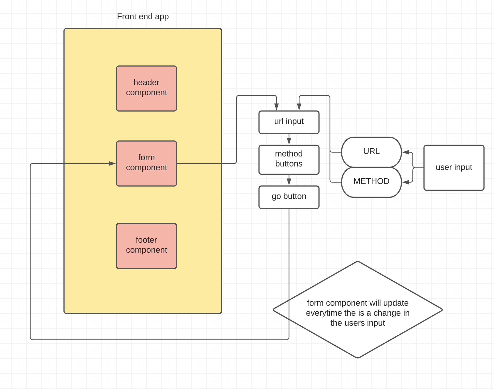

# ReSTy

My application is an API testing tool that can be run in any browser, allowing a user to easily interact with APIs in a familiar interface.

### Author

Lulu Sevignon

### Running the app
- npm start

### Problem Domain

#### Phase 1:
- **As a user**, I expect an easy to read and understand user interface so that I can use the application intuitively
- As a user, I want to enter the URL to a REST API and select the REST method to use to access it
- As a user, I want visual confirmation that my entries and selections are valid so that I have confidence the application will be able to fetch the API data that I’ve requested

#### Phase2: 
- As a user, I want to enter the URL to an API and issue a GET request so that I can retrieve it’s data
- As a user, I want to see the results returned from an API request in my browser in a readable format

#### Phase3: 
- As a user, I want to be able to use all REST methods so that I can do more than just get data
- As a user, I want a simple list of all previous queries I’ve run so that I can easily see which queries I’ve run before
- As a user, I want to click on an old query and have my selections appear in the form for me, so I don’t have to re-type them
- As a user, I want to see a “loading” indicator while RESTy is fetching data so that I know it’s working on my request

#### Phase4:
- As a user, I want to see all of my previous queries as a separate page so that I can browse them in greater detail
- As a user, I would like to view a separate “Help” page so I can learn how the application works

### Technical Requirements

- React
- ES6 Classes
- Shared Component State
- Local Storage for storing request history
- Superagent or Axios for performing API Requests
- SASS for styling

### UML

